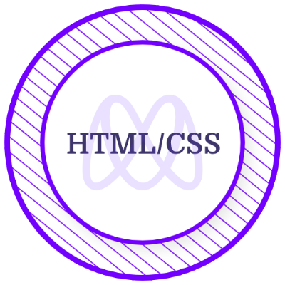

<h2 align="center"> Hi, I'm Ishmael KARGBO!</h2>
<h3 align="center">A software developer from Sierra Leone</h3>

<p align="center">Currently, I am a remote student at Microverse studying to become a Full-Stack Developer. I have a great passion for learning languages and frameworks. In addition to that, I really enjoy designing websites and implementing those designs.</p>


---
[](https://linkedin.com/in/ishmael-kargbo-503660169) [](https://github.com/ishmaelkargbo) 

---
<!-- - 🤔 I’m looking for help with digital marketing to drive traffic to my blog -->
- 🔭 I’m currently studying at **Microverse**
- 🌱 I’m currently learning **GoLang**
- 📫 How to reach me:
  **[Twitter](https://twitter.com/ishodev)**

---

<h2 align="left">Certificates & Licenses</h2>
<a href="https://www.credential.net/884d8ed0-7ec8-4e51-9927-ad409273e4dc" target="blank"></a> 
<a href="https://www.credential.net/ca9f6558-53d8-4827-b196-6273a6f3859b" target="blank"></a> 

---

### A little more about me...  


```javascript
const aboutMe = {
  lookingFor: "Front-end developer" || "Full-stack developer",
  pronouns: ["he", "him"],
  code: [JavaScript, React, Vue, TypeScript, Ruby on Rails, Python, Taildwindcss, ],
  challenge: "I am doing the advence GoLang course to focused on GoLang"
}
```

---


### 📈 My Github Stats


